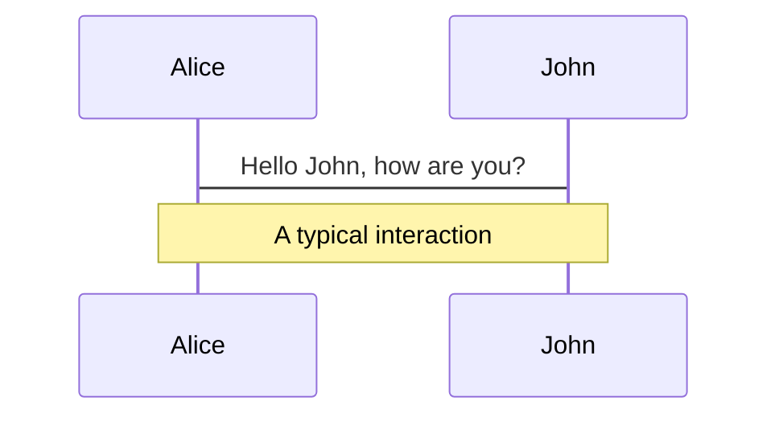
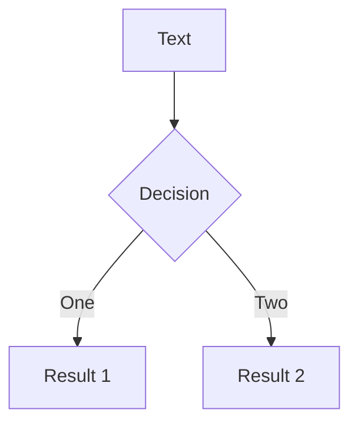
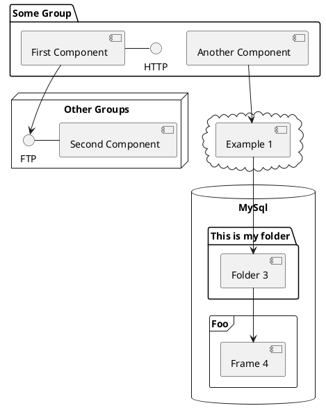

# Web 前端技术发展前沿（偏产品向）

本文内容具有一定局限性，不代表社区真实现状，仅做参考！

<div class="pt-12">
  <span @click="$slidev.nav.next" class="px-2 py-1 rounded cursor-pointer" hover="bg-white bg-opacity-10">
     小芋头君@yootou.com
  </span>
</div>

<div class="abs-br m-6 flex gap-2">
  <!-- <button @click="$slidev.nav.openInEditor()" title="Open in Editor" class="text-xl icon-btn opacity-50 !border-none !hover:text-white">
    <carbon:edit />
  </button> -->
  <a href="https://github.com/slidevjs/slidev" target="_blank" alt="GitHub"
    class="text-xl icon-btn opacity-50 !border-none !hover:text-white">
    <carbon-logo-github />
  </a>
</div>

<!--
The last comment block of each slide will be treated as slide notes. It will be visible and editable in Presenter Mode along with the slide. [Read more in the docs](https://sli.dev/guide/syntax.html#notes)
-->

---

# 本文主要内容

- 实时体验（Realtime experience）
- 在线协作（Online collaboration）
- Web 3D 技术
- 浏览器系统能力
- 应用快速搭建
- 移动端
- 区块链

---

# 实时体验

<br/>

[https://vercel.com](https://vercel.com)

<br/>

在 2021 年 6 月，Next.js 框架背后的开发商 Vercel 在 C 轮融资中筹集了 1.02 亿美金，使其估值达到 11 亿美元，正式成为了一家独角兽企业。11 月份，Vercel 再次宣布获得新的融资，其在 D 轮融资中筹集了 1.5 亿美元，使其估值相比之前翻了一番，达到 25 亿美元。

- 70 CITIES
- 24B+ REQUESTS PER WEEK
- 10PB DATA SERVED
- 99.99% GUARANTEED UPTIME

<br/>

部署前端应用的云服务，也支持简单的服务端、存储等。

---

# <svg role="img" aria-label="Vercel Inc." height="40" viewBox="0 0 283 64" fill="var(--geist-foreground)"><path d="M37 0l37 64H0L37 0zM159.6 34c0-10.3-7.6-17.5-18.5-17.5s-18.5 7.2-18.5 17.5c0 10.1 8.2 17.5 19.5 17.5 6.2 0 11.8-2.3 15.4-6.5l-6.8-3.9c-2.1 2.1-5.2 3.4-8.6 3.4-5 0-9.3-2.7-10.8-6.8l-.3-.7h28.3c.2-1 .3-2 .3-3zm-28.7-3l.2-.6c1.3-4.3 5.1-6.9 9.9-6.9 4.9 0 8.6 2.6 9.9 6.9l.2.6h-20.2zM267.3 34c0-10.3-7.6-17.5-18.5-17.5s-18.5 7.2-18.5 17.5c0 10.1 8.2 17.5 19.5 17.5 6.2 0 11.8-2.3 15.4-6.5l-6.8-3.9c-2.1 2.1-5.2 3.4-8.6 3.4-5 0-9.3-2.7-10.8-6.8l-.3-.7H267c.2-1 .3-2 .3-3zm-28.7-3l.2-.6c1.3-4.3 5.1-6.9 9.9-6.9 4.9 0 8.6 2.6 9.9 6.9l.2.6h-20.2zM219.3 28.3l6.8-3.9c-3.2-5-8.9-7.8-15.8-7.8-10.9 0-18.5 7.2-18.5 17.5s7.6 17.5 18.5 17.5c6.9 0 12.6-2.8 15.8-7.8l-6.8-3.9c-1.8 3-5 4.7-9 4.7-6.3 0-10.5-4.2-10.5-10.5s4.2-10.5 10.5-10.5c3.9 0 7.2 1.7 9 4.7zM282.3 5.6h-8v45h8v-45zM128.5 5.6h-9.2L101.7 36 84.1 5.6h-9.3L101.7 52l26.8-46.4zM185.1 25.8c.9 0 1.8.1 2.7.3v-8.5c-6.8.2-13.2 4-13.2 8.7v-8.7h-8v33h8V36.3c0-6.2 4.3-10.5 10.5-10.5z"></path></svg>

<br/>

## 核心特色

<br/>

- 产品定位和产品功能极简，官方定义：Develop. Preview. Ship.
- 部署过程极简，连接 Github 账号、导入 Github 项目、Deploy、Preview，最小步骤完成。
- \* 在 vercel 里部署应用的各种过程都不需要刷新页面，所有状态都会实时生效

---

# <svg role="img" aria-label="Vercel Inc." height="40" viewBox="0 0 283 64" fill="var(--geist-foreground)"><path d="M37 0l37 64H0L37 0zM159.6 34c0-10.3-7.6-17.5-18.5-17.5s-18.5 7.2-18.5 17.5c0 10.1 8.2 17.5 19.5 17.5 6.2 0 11.8-2.3 15.4-6.5l-6.8-3.9c-2.1 2.1-5.2 3.4-8.6 3.4-5 0-9.3-2.7-10.8-6.8l-.3-.7h28.3c.2-1 .3-2 .3-3zm-28.7-3l.2-.6c1.3-4.3 5.1-6.9 9.9-6.9 4.9 0 8.6 2.6 9.9 6.9l.2.6h-20.2zM267.3 34c0-10.3-7.6-17.5-18.5-17.5s-18.5 7.2-18.5 17.5c0 10.1 8.2 17.5 19.5 17.5 6.2 0 11.8-2.3 15.4-6.5l-6.8-3.9c-2.1 2.1-5.2 3.4-8.6 3.4-5 0-9.3-2.7-10.8-6.8l-.3-.7H267c.2-1 .3-2 .3-3zm-28.7-3l.2-.6c1.3-4.3 5.1-6.9 9.9-6.9 4.9 0 8.6 2.6 9.9 6.9l.2.6h-20.2zM219.3 28.3l6.8-3.9c-3.2-5-8.9-7.8-15.8-7.8-10.9 0-18.5 7.2-18.5 17.5s7.6 17.5 18.5 17.5c6.9 0 12.6-2.8 15.8-7.8l-6.8-3.9c-1.8 3-5 4.7-9 4.7-6.3 0-10.5-4.2-10.5-10.5s4.2-10.5 10.5-10.5c3.9 0 7.2 1.7 9 4.7zM282.3 5.6h-8v45h8v-45zM128.5 5.6h-9.2L101.7 36 84.1 5.6h-9.3L101.7 52l26.8-46.4zM185.1 25.8c.9 0 1.8.1 2.7.3v-8.5c-6.8.2-13.2 4-13.2 8.7v-8.7h-8v33h8V36.3c0-6.2 4.3-10.5 10.5-10.5z"></path></svg>

<br/>

 <video src="/1.mp4" controls style="height:70%;border-radius:5px;"/>

---

### Keyboard Shortcuts

|                                                    |                             |
| -------------------------------------------------- | --------------------------- |
| <kbd>right</kbd> / <kbd>space</kbd>                | next animation or slide     |
| <kbd>left</kbd> / <kbd>shift</kbd><kbd>space</kbd> | previous animation or slide |
| <kbd>up</kbd>                                      | previous slide              |
| <kbd>down</kbd>                                    | next slide                  |

<!-- https://sli.dev/guide/animations.html#click-animations -->


<p v-after class="absolute bottom-23 left-45 opacity-30 transform -rotate-10">Here!</p>

---

layout: image-right
image: https://source.unsplash.com/collection/94734566/1920x1080

---

# Code

Use code snippets and get the highlighting directly![^1]

```ts {all|2|1-6|9|all}
interface User {
  id: number;
  firstName: string;
  lastName: string;
  role: string;
}

function updateUser(id: number, update: User) {
  const user = getUser(id);
  const newUser = { ...user, ...update };
  saveUser(id, newUser);
}
```

<arrow v-click="3" x1="400" y1="420" x2="230" y2="330" color="#564" width="3" arrowSize="1" />

[^1]: [Learn More](https://sli.dev/guide/syntax.html#line-highlighting)

<style>
.footnotes-sep {
  @apply mt-20 opacity-10;
}
.footnotes {
  @apply text-sm opacity-75;
}
.footnote-backref {
  display: none;
}
</style>

---

# Components

<div grid="~ cols-2 gap-4">
<div>

You can use Vue components directly inside your slides.

We have provided a few built-in components like `<Tweet/>` and `<Youtube/>` that you can use directly. And adding your custom components is also super easy.

```html
<Counter :count="10" />
```

<!-- ./components/Counter.vue -->
<Counter :count="10" m="t-4" />

Check out [the guides](https://sli.dev/builtin/components.html) for more.

</div>
<div>

```html
<Tweet id="1390115482657726468" />
```

<Tweet id="1390115482657726468" scale="0.65" />

</div>
</div>

---

## class: px-20

# Themes

Slidev comes with powerful theming support. Themes can provide styles, layouts, components, or even configurations for tools. Switching between themes by just **one edit** in your frontmatter:

<div grid="~ cols-2 gap-2" m="-t-2">

```yaml
---
theme: default
---
```

```yaml
---
theme: seriph
---
```


</div>

Read more about [How to use a theme](https://sli.dev/themes/use.html) and
check out the [Awesome Themes Gallery](https://sli.dev/themes/gallery.html).

---

## preload: false

# Animations

Animations are powered by [@vueuse/motion](https://motion.vueuse.org/).

```html
<div v-motion :initial="{ x: -80 }" :enter="{ x: 0 }">Slidev</div>
```

<div class="w-60 relative mt-6">
  <div class="relative w-40 h-40">
    
    
    
  </div>

  <div
    class="text-5xl absolute top-14 left-40 text-[#2B90B6] -z-1"
    v-motion
    :initial="{ x: -80, opacity: 0}"
    :enter="{ x: 0, opacity: 1, transition: { delay: 2000, duration: 1000 } }">
    Slidev
  </div>
</div>

<!-- vue script setup scripts can be directly used in markdown, and will only affects current page -->
<script setup lang="ts">
const final = {
  x: 0,
  y: 0,
  rotate: 0,
  scale: 1,
  transition: {
    type: 'spring',
    damping: 10,
    stiffness: 20,
    mass: 2
  }
}
</script>

<div
  v-motion
  :initial="{ x:35, y: 40, opacity: 0}"
  :enter="{ y: 0, opacity: 1, transition: { delay: 3500 } }">

[Learn More](https://sli.dev/guide/animations.html#motion)

</div>

---

# LaTeX

LaTeX is supported out-of-box powered by [KaTeX](https://katex.org/).

<br>

Inline $\sqrt{3x-1}+(1+x)^2$

Block

$$
\begin{array}{c}

\nabla \times \vec{\mathbf{B}} -\, \frac1c\, \frac{\partial\vec{\mathbf{E}}}{\partial t} &
= \frac{4\pi}{c}\vec{\mathbf{j}}    \nabla \cdot \vec{\mathbf{E}} & = 4 \pi \rho \\

\nabla \times \vec{\mathbf{E}}\, +\, \frac1c\, \frac{\partial\vec{\mathbf{B}}}{\partial t} & = \vec{\mathbf{0}} \\

\nabla \cdot \vec{\mathbf{B}} & = 0

\end{array}
$$

<br>

[Learn more](https://sli.dev/guide/syntax#latex)

---

# Diagrams

You can create diagrams / graphs from textual descriptions, directly in your Markdown.

<div class="grid grid-cols-3 gap-10 pt-4 -mb-6">







</div>

[Learn More](https://sli.dev/guide/syntax.html#diagrams)

---

layout: center
class: text-center

---

# Learn More

[Documentations](https://sli.dev) · [GitHub](https://github.com/slidevjs/slidev) · [Showcases](https://sli.dev/showcases.html)
